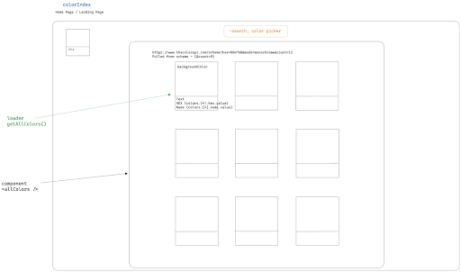
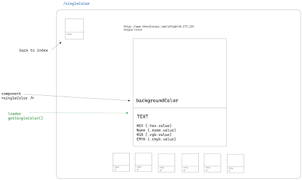
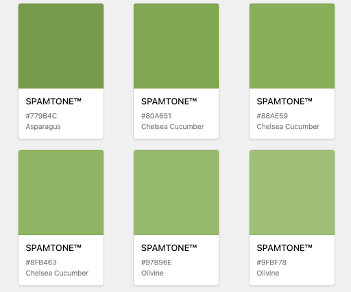
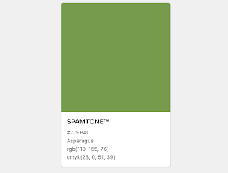
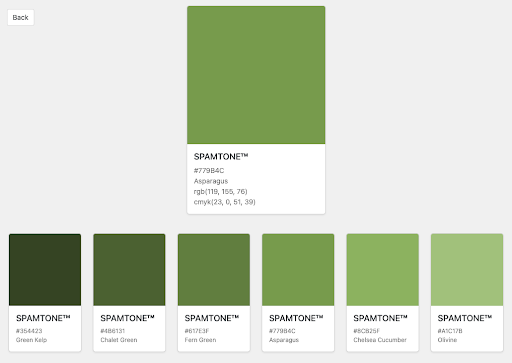
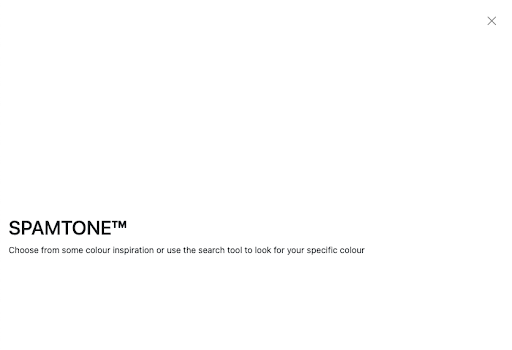
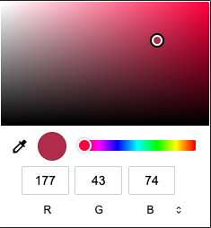
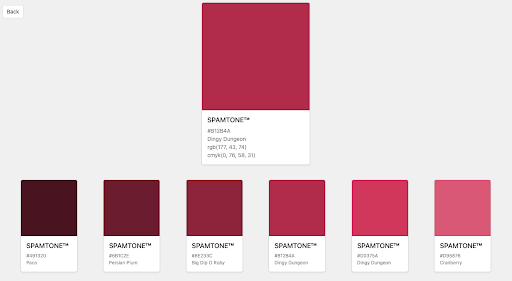
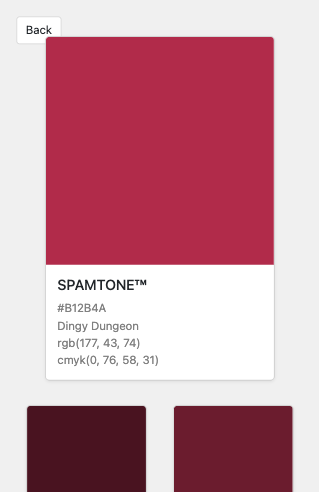

# SPAMTONE

## Description

SPAMTONE is a colour search and colour scheme inspiration tool. This was completed during our sixth week of the course as a pair, within 2 days, using React. 

## Deployment link

[SPAMTONE Live Link](https://spamtone.netlify.app/)

## Getting Started/Code Installation

#### Packages to download
* React `npm i react`
* React-router-dom `npm i react-router-dom`
* Bootstrap `npm i react-bootstrap bootstrap` 
* Sass `npm i sass`
* Node `npm i node`
* Vite `npm create vite@latest` - React, Javascript + SWC

## Timeframe & Working Team (Pair)

Working as a pair with Liz Alexander - 2 day hackathon.<br>
Start planning Wednesday 22nd Nov 2023 for presentations Friday 24th Nov 2023.

## Technologies Used
* Excalidraw - for wireframing
* Insomnia - for APIs
* [The Color API](https://www.thecolorapi.com/docs) - selected API
* VS Code
* HTML
* CSS
* JavaScript
* React
* Bootstrap
* Sass
* Vite
* Chrome DevTools
* GitHub
* Netlify


## Brief

#### Overview
​The second project is to build a React application that consumes a public API.​

#### Technical Requirements
​Your app must:​
* Consume a public API – this could be anything but it must make sense for your project.
* Have several components
* The app can have a router - with several "pages", this is up to you and if it makes sense for your project.
* Include wireframes - that you designed before building the app.
* Be deployed online and accessible to the public.


## Planning

#### Ideas
We had some rough ideas on options and looked at different related APIs
We then tested the APIs with Insomnia, and read the documentation to see what was possible. Liz had found a colour API that had lots of information, was free and had no rate limits. We tested some of the requests through Insomnia to see which data we had access to. 

#### Wireframing
We mocked up the basic UI of the pages, and added in the data endpoints for the API, also thinking on which elements would be components and the loader information. 





#### Working Process
Most work was carried out together in a paired coding format, we also used Live Share for VS code and screen share in Zoom to follow along.


## Build/Code Process

#### Wednesday
Liz got the folders and files in order, set up with imports and exports, and downloaded extra packages.
I began logging out API to check we can get the information we needed.
There were issues getting the data as we had to go an extra level down into an array, so had to add more to `.data` so the json needed to be `return data.colors` to get started.
I got the API to start feeding in the colour scheme data with a hard coded starter colour, and styled this on the main page with Bootstrap container and cards. 
```javascript
// Loader to get all colours
export async function getAllColors() {
  const response = await fetch(`https://www.thecolorapi.com/scheme?hex=779B4C&count=9`)
  const data = await response.json()
  // had to set it this way so we could access the data within
  return data.colors
}
 ```



#### Thursday
The main colour scheme page is fed a randomised HEX code on load to display a different colour scheme for inspiration each time the user enters the page.
```javascript
// Loader to get all colours
export async function getAllColors() {
  const response = await fetch(`https://www.thecolorapi.com/scheme?hex=${randomHexColorCode()}&count=16`)
  const data = await response.json()
  // had to set it this way so we could access the data within
  return data.colors
 }
// Generating a random hex code for use in getAllColors loader
const randomHexColorCode = () => {
  let n = (Math.random() * 0xfffff * 1000000).toString(16)
  const newCode = n.slice(0, 6)
  return newCode
}
randomHexColorCode()
```

The main colour scheme page links to a single colour page based on which colour card the user clicks on.



There is a colour picker on the main page that you can select a colour from, and by clicking the search button you are taken to the single colour page which will display the selected colour’s information.
```javascript
const [ pickerColor, setPickerColor ] = useState('#BE3455')

const noHashColor = pickerColor.split('#')[1]

return (
  <main>
  {/* Search bar - colour picker */}
    <section className="color-picker-section">
      <Form.Label hidden htmlFor="exampleColorInput"></Form.Label>
      <Form.Control
        type="color"
        id="exampleColorInput"
        defaultValue={ pickerColor }
        title="Choose your color"
        onChange={(e) => setPickerColor(e.target.value)}
      />
      <Link to={`/color/${noHashColor}`} className="btn">SEARCH</Link>
    </section>
```

The single colour index page also displays a colour scheme based on the main colour.
Added styling to page layouts, cards, and hover effects.



#### Friday
Finalised some layout styling for padding/margin on colour cards, and button positioning, and added in media queries for mobile view for better sizing on a smaller screen.
Added in a Bootstrap modal on page load as a welcome screen for a user’s first time into the site. 
Deployed the site to Netlify.




## Challenges

On first seeing the API data in Insomnia, I was hopeful that getting the single colour API data would be quite easy as one of the data points was the final part of the API URL that we needed to call, in `_links.href`
```
"_links": {
  "self": {
  "href": "/id?hex=365CB5"
  }
},
```
This turned out to not be the case as appending a link to a link caused the loader function to fail and return undefined. The workaround was then to split the data point to return the HEX code we needed. 
```javascript
// Deconstructed ID - can use clean hex as well
  const href = color._links.self.href
  const id = href.split('=')[1]
```
What we should have done is use the data point hex.clean as that would have given us the same result in less code. In future I will make sure to only append the necessary query parameters!

```
"hex": {
"value": "#365CB5",
"clean": "365CB5
},
```		

On our single colour page we wanted to have the main single colour card but also the related colour schemes that would compliment the card. To do this we needed to make two separate API calls for the single colour and for the colour scheme so we needed to use `Promise.all` to be able to feed the two calls into the one loader.
```javascript
{
  path: "/color/:colorID",
  element: <SingleColor />,
  loader: async ({ params }) => {
    const [singleColor, singleColorScheme] = await Promise.all([
    getSingleColor(params.colorID),
    getSingleColorScheme(params.colorID)
    ])
    return {singleColor, singleColorScheme}
  }
 }
```
We could then get the data for the single colour card:
```javascript
export default function SingleColor() {
  // loader
  const data = useLoaderData()
  const hexVal = data.singleColor.hex.value
  const rgbVal = data.singleColor.rgb.value
...
```
And map through the data for the colour scheme:
```javascript
{data.singleColorScheme.map(color => {
  const hexVal = color.hex.value
  const nameVal = color.name.value
...
```


## Wins

From the first part of planning the colour API idea, I wanted the user to be able to search using a colour picker. I thought the theory of it may be fairly simple as I just needed to get the value from the chosen colour and away we go. But without researching I imagined it may be more difficult than it seemed, as often my ideas turn out to be. I found out the opposite and was pleasantly surprised with the few steps actually needed! I could add a HTML colour picker which (thankfully) would already return a HEX value, which is what we required. I then just needed to feed that in as a query parameter and we could navigate to our single colour page. 
I used state to set a default value of the colour picker for page load, and then we just needed an onChange to see the colour picker value as it changed. To test, this was logged to the console and we could see every single change being printed as the mouse moved across the colours.



This was great, but wasn’t ideal as we wanted one set value once the user had finalised their colour decision. Liz had the idea that we have a submit button. Yes - this meant the user would finalise their choice and then move to the submit button meaning the choice stayed intact.
The colour picker value was set with state and then learning from a previous mistake, I made sure the returned value was in the exact format required for the query parameter (removing the `#`) and that was sent to the loader. 
Clicking the search button then takes you to the single colour page with all the information on your chosen colour and a colour scheme below to match.
```javascript
const [ pickerColor, setPickerColor ] = useState('#BE3455')
  const noHashColor = pickerColor.split('#')[1]
  return (
    <main>
      {/* Search bar - colour picker */}
      <section className="color-picker-section">
        <Form.Label hidden htmlFor="exampleColorInput"></Form.Label>
        <Form.Control
          type="color"
          id="exampleColorInput"
          defaultValue={ pickerColor }
          title="Choose your color"
          onChange={(e) => setPickerColor(e.target.value)}
        />
        <Link to={`/color/${noHashColor}`} className="btn">SEARCH</Link>
      </section>
```




## Key Learnings/Takeaways

Working with Liz taught me to slow down and read things thoroughly. On researching answers, I found that if the answer wasn’t readily available then I would continue to search elsewhere. Whereas Liz would take a beat, read through and normally have found the answer on the first or second thing we had been looking through.

I feel more confident with Bootstrap and Sass, although these weren’t used as much as they could have been, I can see how implementing them within a project can speed up some more intensive sections, for example instead of creating a modal or nav menu with HTML. 


## Bugs

Not so much a bug as much as a missed styling error, for our mobile view single colour page, the back button is partially overlapped by the main colour card, so that needs to be corrected. 




## Future Improvements

* Having a click to copy on each piece of colour information on the colour cards, so people could click the HEX or RGB code and have the details on their clipboard ready to paste, rather than needing to highlight and copy. 
* Have the search tool colour be the same as the colour pallet on page load. As the colour scheme on the main page changes each time, it’s a little jarring if the set colour clashes with the rest of the page.
* Playing more with the layout of the cards to flow a little better and maybe have them sit around the search tool on the main page, rather than in a separate column which means you’re not using space below it.
